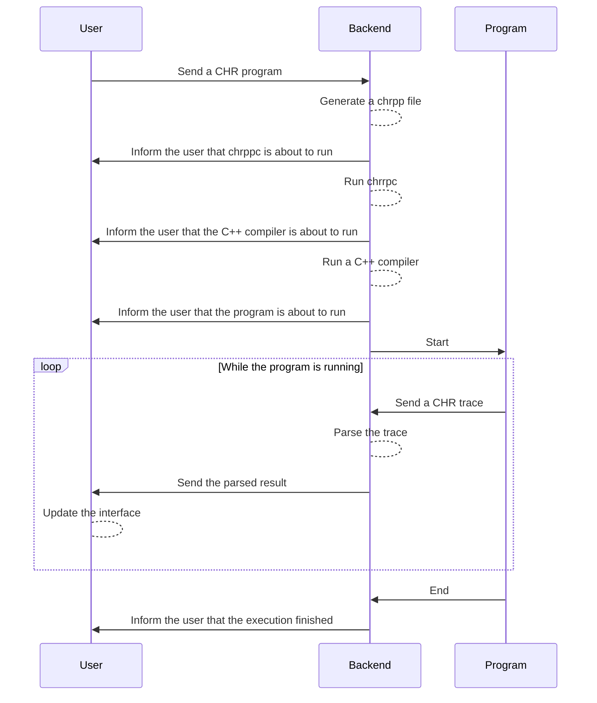

[](https://github.com/ttcchhmm/chr-ide/actions/workflows/docker-image.yml)

<p align="center">
    

<center>CHR IDE is a web-based playground built around <a href="https://gitlab.com/vynce/chrpp">CHR++</a></center>
</p>

# How to run
[A Docker image](https://github.com/users/ttcchhmm/packages/container/package/chr-ide) is provided with this project:
```bash
docker run --rm -p 3000:3000 ghcr.io/ttcchhmm/chr-ide:latest
```

Then open `http://localhost:3000` in your web browser.

> [!NOTE]
> The image hosted on GitHub is only built for `x86_64`.
>
> If you're using an ARM-based system (such as an Apple Silicon Mac or a Raspberry Pi) and you want to avoid relying on a software-based emulator, please [build your own image](#build-the-docker-image).

## Configuration
If you're only using it on your local machine, the Docker image is plug-and-play, no additional configuration is required.

However, if you're hosting it over the network some configuration is required:
- The application should be hosted over an HTTPS connection.
  - [This is due to browsers limiting APIs when sites are accessed in an insecure way.](https://developer.mozilla.org/en-US/docs/Web/Security/Secure_Contexts)
- The allowed origins should be configured in the server configuration.
  - See documentation about `CHR_IDE_ALLOWED_ORIGINS` in the [backend README file](packages/backend/README.md#configuration).

# Browser support
For a better experience, a browser that supports the [File System Access API](https://caniuse.com/native-filesystem-api) is recommended. As of writing, only Chromium-based browsers running on a desktop OS are supported.

Browsers without this API will fallback to downloading the current workspace every time the user wants to save.

# Development
## Dependencies
- **An UNIX-based system**: Linux (Arch, Ubuntu) and macOS were tested as development targets
  - Windows users are encouraged to use [WSL](https://learn.microsoft.com/en-us/windows/wsl/about)
- [**Node.js**](https://nodejs.org): At least version 22
- **[CHR++](https://gitlab.com/vynce/chrpp)**
- **A C++ compiler**: Both GCC and LLVM should work
  - GCC is used when running CHR IDE with Docker
- **Git**
- **Docker**: Optional, only when testing the final production image

[Visual Studio Code](https://code.visualstudio.com/) is the recommended editor when working on this project, but any code editor will do.

## Build and run using npm
The following npm scripts are available across the entire project structure:
- `build`: Rebuild every workspace from scratch
- `clean`: Delete build output
- `lint`: Run [ESLint](https://eslint.org/)
- `dev:backend`: Start the backend on port 3000
- `dev:frontend`: Start the frontend on port 4000
- `dev:simple-client`: Start the simple client

## Global structure
This project is written using [TypeScript](https://www.typescriptlang.org/) and the frontend uses [Nuxt](https://nuxt.com) with [Vue Single-File Components (SFC)](https://vuejs.org/guide/scaling-up/sfc.html).

The CHR IDE source is composed of a single monorepo:
- [`/`](/): Global configuration.
  - [`/packages`](packages): Contains different npm workspaces.
    - [`/core`](packages/core): Elements shared across every workspace, such as Socket.io typing information.
    - [`/backend`](packages/backend/): Server-side software that handle code compilation, execution and the parsing of the generated CHR++ output.
    - [`/frontend`](packages/backend/): A [Nuxt](https://nuxt.com) project for the web interface. See the [Nuxt documentation about directory structure](https://nuxt.com/docs/guide/directory-structure/app) to learn more.
    - [`/simple-client`](packages/simple-client/): A basic client to test the backend without having to run the full web interface.
  - [`/.github/workflows`](.github/workflows/): CI/CD pipelines.
  - [`/.husky`](.husky): Git pre-commit hooks, configured using [Husky](https://typicode.github.io/husky/).
  - [`/.vscode`](.vscode): Recommended Visual Studio Code configuration and extensions.

## How CHR programs are executed
CHR IDE relies on [Socket.io](https://socket.io/) for an asynchronous, event-driven and reliable communication between the backend and the frontend.



## Build the Docker image
To build the Docker image from sources, run:
```bash
docker build -t chr-ide:latest .
```

And to run it:
```bash
docker run --rm -p 3000:3000 chr-ide:latest
```

# Credits
This project was made under the supervision of [Vincent Barichard](https://gitlab.com/vynce), associate professor at [LERIA](https://leria.univ-angers.fr/) ([University of Angers](https://univ-angers.fr)) and the author of the [CHR++ project](https://gitlab.com/vynce/chrpp).

CHR IDE was written by:
- [Quentin Raimbault](https://github.com/Qraim)
- [Victor Loiseau](https://github.com/Gyrehio/)
- [Tom Chedmail](https://github.com/ttcchhmm)